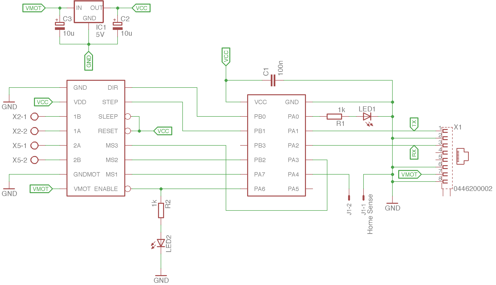
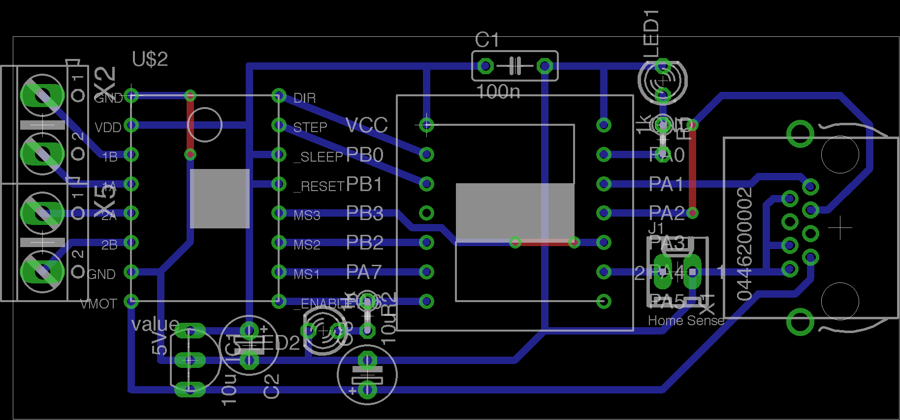
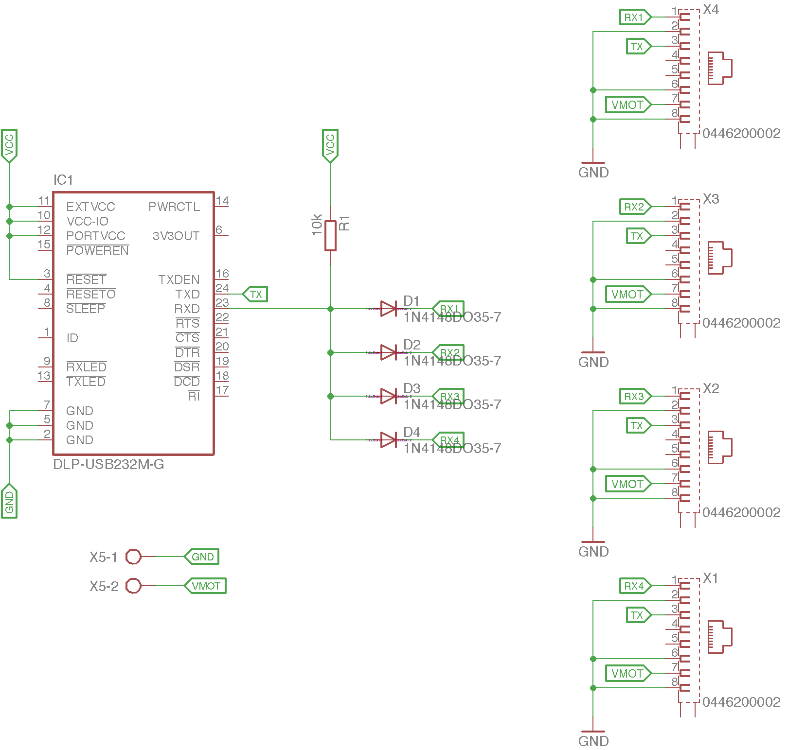
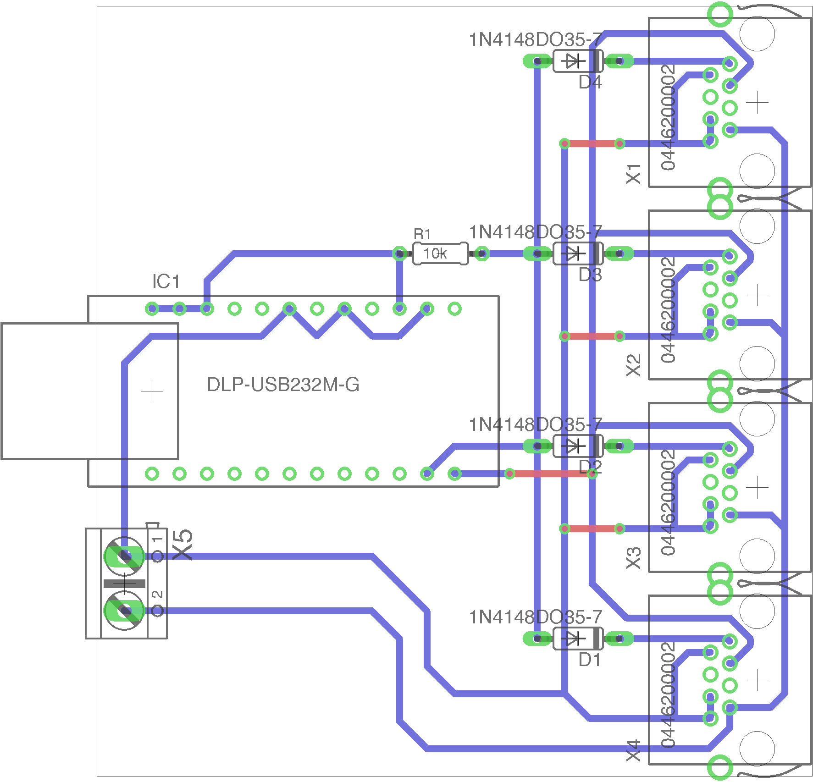

# StepperDrive
This embedded project features a simple controller board for a stepper motor and a hub to connect one or multiple of these boards.
Each motor can then be controlled with simple SCPI-like commands via UART (8N1 9600baud) to move to a position, set the maximum rate and acceleration etc.

## Hardware
The boards are breadboards (Lochrasterplatinen), so the **PCB is not for etching**, but soldering wires on a grid.

#### Controller board
Schematic                          |  PCB
:---------------------------------:|:-----------------------------:
 | 

The board consist mainly of a [A4988](https://www.pololu.com/file/download/a4988_DMOS_microstepping_driver_with_translator.pdf?file_id=0J450) [module](https://eckstein-shop.de/A4988-StepStick-Compatible-Stepper-Motor-Driver-fuer-3D-Printer) (often used in DIY 3D printers) and an [ATtiny841](http://www.atmel.com/Images/Atmel-8495-8-bit-AVR-Microcontrollers-ATtiny441-ATtiny841_Datasheet.pdf) microcontroller.
Supply voltage (VMOT = +12V) and UART signals are delivered via a RJ45 plug.

Note that MS3 cannot be connected to PB3 because PB3 is the reset pin (setting to low is not possible when not configured explicitly as an GPIO pin, and this would make re-flashing more difficulty).

#### Hub
Schematic                   |  PCB
:--------------------------:|:-----------------------------:
 | 

The hub can distribute power and UART signals to each controller board.
It was tested with up to 4 motors and a cable length of 10m and it worked without problems.

Note that there is no real anti-collision protocol, but as the communication is quit fast, there should be no problem to query each motors parameters individually with their IDs after another.
E.g. `AX1:POS?` then `AX2:POS?`.
Sending commands can be even done simultaneously, e.g. `AX1:POS 180;AX2:POS 22.5`.

## Commands
#### Common rules
Commands are simple ascii strings (no binary shenanigans, so human readable), terminated with `\n` (linefeed).
The string length must not exceed 64 chars in total (could be raised probably, not tested).
The commands have to be send with 9600 baud, 8 byte, no parity and 1 stop bit (8N1).

At the moment, only one command is parsed for each axis at a time, i.e. it is not possible to set the rate and position for a motor in one string.
However, it is possible to send one command to each motor simultaneously, by separating the commands with semicolons.
You can send commands and receive replies while the motor is moving, e.g. you can set a new position - the motor will instantly move to that position even it has not reached its last target position.

All commands must begin with `AX`, followed by the axis identifier number as specified when the microcontroller was programmed using the makefile. E.g. for `make ID=3` the axis identifier is `AX3`.
If you forgot the ID, you can query it (works only when 1 controller board is connected to the hub) using `*IDN?`.
Note that you cannot set the ID via commands.

All parameters and subparameters have to be separated with a colon (`:`), followed by either a query (`?`) or the value.
E.g. `AX1:POS?`, `AX4:POW ON`, `AX2:LIM:MAX 360` or `AX3:SUB2`.
Note that the questionmark must follow immediately, while a value can have a leading white space (not required though).

Commands are case-sensitive (all capital letters).

#### List of commands
- `:POW` [`ON` or `OFF`] Motor power on or off. Probably the first thing you do is to turn the power on. Default `OFF`.
- `:ACC` [positive integer] Acceleration factor. This controls how smooth the movement to a target position starts. A value of `1` is very smooth, while `100` is like constante rate. Default is `100`.
- `:DEC` [positive integer] Decceleration factor. This controls how smooth the movement to a target position ends. A value of `1` is very smooth, while `100` is like constante rate. Default is `10`.
- `:HOME` [integer] Moves the motor into the direction given by the sign of the value (e.g. `-1` or `1`) until the home sense pin goes low or the axis made 100 rounds. After that, the position is defined as 0 degree. When requested, the reply is either `1` (at home) or `0` not homed/homing in progress.
- `:POS` [float or integer] Axis position (angle) in degree.
- `:LIM:MAX` [positive float or integer] Upper speed limit in degree/s. Must not be set higher than `8000*360/(substeps*steps_per_revolution)` (steps per revolution is set the in makefile and is 200 for most motors). Default 360.
- `:LIM:MIN` [positive float or integer] Lower speed limit in degree/s. Must not be set to 0. Default 10.
- `:SUB` [`1`, `2`, `4`, `8` or `16`] Number of substeps. Higher values will result in finer resolution and smoother movements, but also reduced torque and lower maximum rate. Default is `4`. **Important:** Set the substeps before setting or getting any parameter with degree related unit.

## How to program
The firmware is written in C using [AVR-GCC](https://www.mikrocontroller.net/articles/AVR-GCC).
In the [makefile](Makefile) line `PROGRAMMER = -c stk500 -P /dev/cu.SLAB_USBtoUART`, you can specify your programmer (`-c`) which must be known to [avrdude](http://www.nongnu.org/avrdude/user-manual/avrdude_4.html) and the port (`-P`) where you connect the programmer to your computer.
I used the [mySmartUSB light](http://shop.myavr.de/index.php?sp=article.sp.php&artID=200006) programmer which is compatible to a stk500.
When flashing, specify the axis identifier, e.g. for axis 3, run `make ID=3`.
Remember to also flash the fuses, so the microcontroller runs with 8 MHz: `make fuse`.