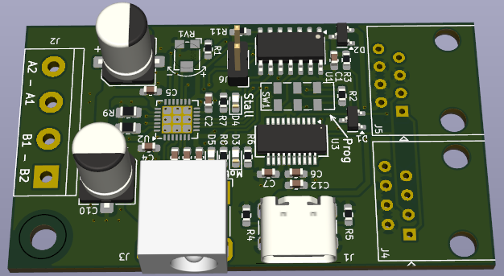

# StepperDrive
This embedded project features a simple controller board for a stepper motor. 
Multiple boards can be connected together. 
One of it has to be attached to USB and power supply. 
Each motor can then be controlled with simple SCPI-like commands via UART (8N1 9600baud) to move to a position, set the maximum rate and acceleration etc.

## Features
- Uses TMC2209 stepper driver IC for smooth and quiet operation
- Multiple boards can be connected to each other via ethernet-cables
- USB-C interface for control and flashing firmware

Note that there is no real anti-collision protocol, but as the communication is quit fast, there should be no problem to query each motors parameters individually with their IDs after another.
E.g. `AX1:POS?` then `AX2:POS?`.
Sending commands can be even done simultaneously, e.g. `AX1:POS 180;AX2:POS 22.5`.

## Flashing
The firmware is written in AVR-C for the ATtiny814. To start programming, an extended AVR toolchain is needed, which can be found in the Arduino IDE (the GNU AVR toolchain does NOT support the ATtiny814):
- Go to https://www.arduino.cc/en/software and scroll down to "legacy IDE (1.8.X)" and download the zipped version for your OS
- Unzip and add 
  - (Linux) *arduino-1.8.19-linux64.tar/arduino-1.8.19-linux64/arduino-1.8.19/hardware/tools/avr/bin* or 
  - (Windows) *arduino-1.8.19-windows\arduino-1.8.19\hardware\tools\avr\bin* 
  
  to your systems PATH variable (the rest of the IDE is not needed)
- Install [Make](https://www.gnu.org/software/make/#download) if you have it not already

To transfer the firmware to the microcontroller, install [pymcuprog](https://pypi.org/project/pymcuprog/).
Switch to **Prog** on the PCB.
Edit the PROGRAMMER variable (serial port) in the [firmware/Makefile](Makefile) and run `make flash clean` to build, flash and remove the built files.

## Commands
#### Common rules
Commands are simple ascii strings (no binary shenanigans, so human readable), terminated with `\n` (linefeed).
The string length must not exceed 64 chars in total (could be raised probably, not tested).
The commands have to be send with 9600 baud, 8 byte, no parity and 1 stop bit (8N1).

At the moment, only one command is parsed for each axis at a time, i.e. it is not possible to set the rate and position for a motor in one string.
However, it is possible to send one command to each motor simultaneously, by separating the commands with semicolons.
You can send commands and receive replies while the motor is moving, e.g. you can set a new position - the motor will instantly move to that position even it has not reached its last target position.

All commands must begin with `AX`, followed by the axis identifier number (default `1`) as specified with `AX1:ID <1...9>` (saved in EEPROM). 
If you forgot the ID, you can query it (works only when one controller board is connected to the hub) using `*IDN?`.

All parameters and subparameters have to be separated with a colon (`:`), followed by either a query (`?`) or the value.
E.g. `AX1:POS?`, `AX4:POW ON`, `AX2:LIM:MAX 360` or `AX3:SUB2`.
Note that the questionmark must follow immediately, while a value can have a leading white space (not required though).
When setting a parameter, it is possible to add `;*OPC?` afterwards to get feedback (`1` is returned) when the operation completed.

Commands are case-sensitive (all capital letters).

#### List of commands
- `:POW` [`ON` or `OFF`] Motor power on or off. Probably the first thing you do is to turn the power on. Default `OFF`.
- `:ACC` [positive integer] Acceleration factor. This controls how smooth the movement to a target position starts. A value of `1` is very smooth, while `100` is like constante rate. Default is `100`.
- `:DEC` [positive integer] Decceleration factor. This controls how smooth the movement to a target position ends. A value of `1` is very smooth, while `100` is like constante rate. Default is `10`.
- `:HOME` [float or integer] Moves the motor with given velocity in degree/s until the home sense pin goes low. After that, the position is defined as 0 degree. When requested, the reply is either `1` (at home) or `0` not homed/homing in progress.
- `:POS` [float or integer] Axis position (angle) in degree.
- `:LIM:MAX` [positive float or integer] Upper speed limit in degree/s. Must not be set higher than `8000*360/(substeps*steps_per_revolution)` (steps per revolution is set the in makefile and is 200 for most motors). Default 360.
- `:LIM:MIN` [positive float or integer] Lower speed limit in degree/s. Must not be set to 0. Default 10.
- `:RATE` [positive float or integer] Shorthand for `:LIM:MAX`.
- `:VEL` [positive float or integer] Rotates the axis infinitely with value in degree/s.
- `:SUB` [`8`, `16`, `32` or `64`] Number of substeps. Higher values will result in finer resolution and smoother movements, but also lower maximum rate. Default is `8`. **Important:** Set the substeps before setting or getting any parameter with degree related unit.

## TODOs
Currently, the TMC2209 is controlled via classic STEP, DIR, ENABLE, MS pins by the firmware. The hardware supports to configure the driver via its UART interface, for example to enable stall detection.